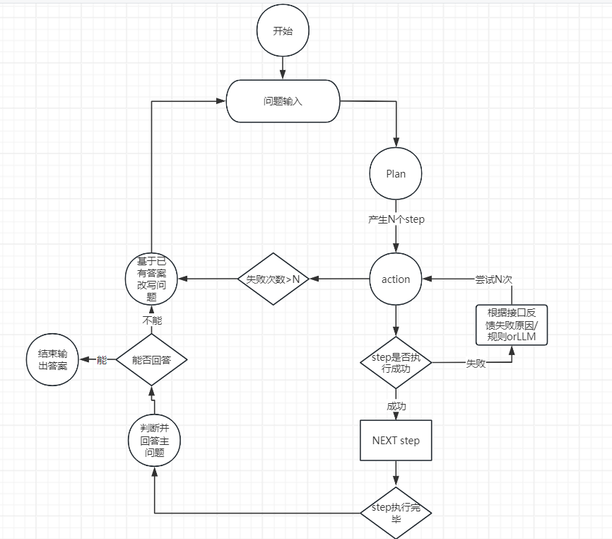

# APIWeaver-lawGLM

lawGLM复赛第五方案 [比赛网址](https://tianchi.aliyun.com/competition/entrance/532221/rankingList)。

如果需要简单了解此方案，可以查看[此教程](./app/simple_demo.ipynb)

其他链接：

SMP-2024大模型图分析挑战赛top3方案，[开源地址](https://github.com/MeiPixel/APIWeaver-Graph)

完整版开源： [APIWeaver](https://github.com/MeiPixel/APIWeaver)

- 支持文档召回
- 支持通过大模型对话式优化prompt
- 支持python package和openapi格式导入
- 支持运行记录转化为llama factory训练格式
- 一键部署gradio

# 方案具体介绍

## 总体思路介绍

这是一个基于接口文档的自动编码框架，核心思路如下：



1. 做出一个准确率比较高的代码规划
2. 在ipython里执行函数，并且可以高准确率的触发连续编码，即使用之前保存的参数
3. 使用API报错提示，反馈到AI,一步步修正AI编码

## 快速开始

1. 安装依赖

```shell
pip install -r requirements.txt
```

2. 创建一个新的kernel

```shell
python -m ipykernel install --user --name=my_kernel --display-name "My Kernel"
```

接着，运行主函数：

```shell
cd app

OPENAI_API_KEY="your ZhipuAI API Keys" python run_with_process.py
```

## 主要步骤说明

1. 预处理，执行简单的连续查询，如公司简称查询全称，案号查询律师事务所，得到结果添加到记忆并判断是否需要下一步。此步骤主要为了解决简单的查询问题。对于过长的句子简化表达。
2. plan-action-api，如果简单的连续查询无法解决问题，或者匹配到问题需要计算，则使用plan-action，对应的两个类——Agent/Planer.py，Agent/Executor.py，api.py
    - plan -
      一次性加载所有的API信息（实际场景考虑向量召回，不做API的召回主要是节省流程时间），先根据题目分类召回1个示例，然后使用COT的方法写出执行的json，检查json是否符合要求，不符合要求打印返回不符合要求的点。
    - action - 加载plan的执行json 并按照次序执行。
    - api-正常调用api流程，主要实现在执行过程中报错优化，例如，输入法院名称，但是没有正则匹配到省市区，则提示action需要省市区全称，案号错误，则提示正确案号如何拼接。

3. 问题改写，对于 1，2 步骤，如果 AI 判定没有完成，则提出新问题循环一次流程。
4. 回答问题，基于所有的执行历史，输入AI一次性回答问题，正则匹配到所有的查询key，告诉AI这些key必须在答案中。
5. 后处理，添加一些小数点转化，日期，括号等匹配修改的功能。

### 预处理

1. 实体识别，使用实体识别prompt识别案号，案号中的法院代字，地址，公司简称，公司代码等实体
2. 将公司简称公司代码统一社会信用代码转为公司全称，如果是API模式则省略此操作加入对应prompt。
3. 连续查询，使用上一步的结果，带入prompt，AI规划下一步使用的接口，实体和需要获得的字段
4. 判断是否完成，和3步骤同一个prompt，会返回是否完成的json
5. 加入tips，使用正则匹配加入一些解题相关的提示，knowledge/priori.py 例如在API模式下，匹配到公司代码，公司简称，统一社会信用代码等实体时，提示AI第一步为转为公司全称。

### plan

1. 召回示例，从 knowledge/hard_sample.py 中找到合适的示例，作为提示示例，示例步骤 3-4步不会出现过拟合
2. 规划，1. 明确问题 2. 找到相关表格字段 3.开始规划 详见 prompt -> plan
3. 检查字段，对AI产生的字段进行检查，并发现问题，如果有问题重新规划，至多三次

### action

1. 召回有用的接口和辅助函数，以为action完全依照plan执行，所以只召回plan相关的接口文档和函数
2. 初始化，将需要的函数放在ipython里执行，
3. 从step1开始执行，每次执行记录结果，成功的话将成功的step加入列表，接下来的step中的base_on_step如果都已经完成了，则可以执行
4. 执行报错有两种情况 1.接口没查到 这时会依据 knowledge/priori.py 中的 ERROR——TIPS匹配到错误返回给AI修改，2. 代码错误
   直接返回报错信息 让AI修改
5. 总结信息，将每一步的结果放入信息中


