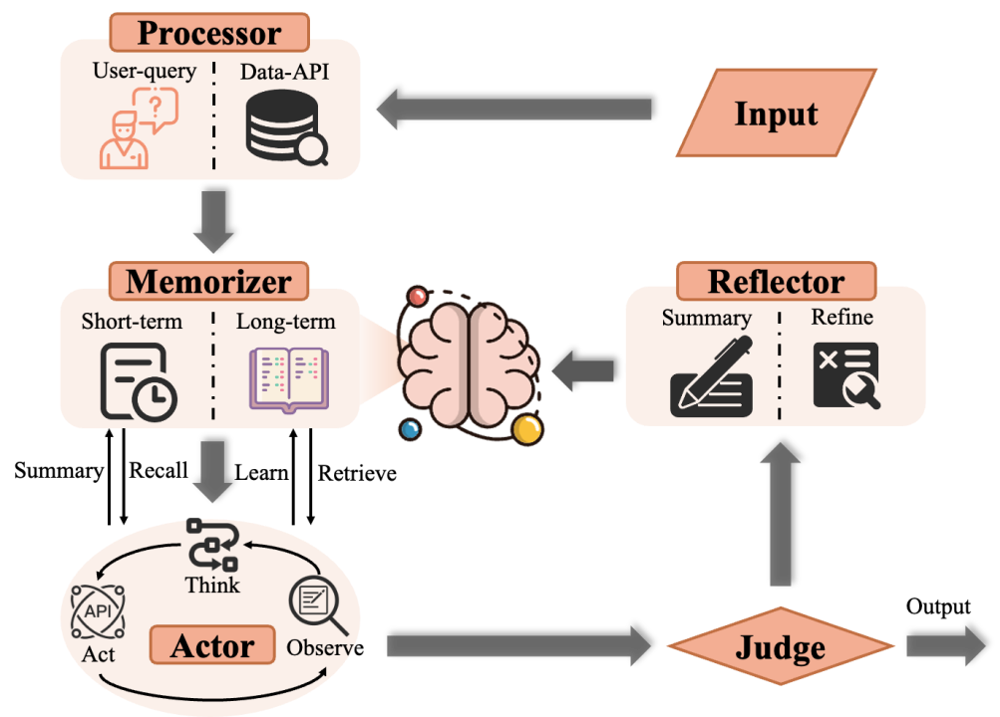

# 方案概述

第三届琶洲算法大赛-GLM法律行业大模型挑战赛道，LegalHi复赛方案，由李海涛，陈俊杰贡献。

# 方案介绍



上图展示的即为我们提出的全局适应的动态法律多智能体协作系统，由Processor、Memorizer、Actor、Judge、Reflector五类智能体组成。

1. 当用户的需求进入系统后，Processor会对查询中的错误和重复信息进行纠正，并筛选出解决该问题需要的外部信息。

2. 之后Memorizer会凝练出短期记忆帮助后续智能体同步信息，同时会检索出与各问题相关的长期记忆，帮助各智能体更好地解决问题。

3. Actor智能体包含思考-行动-观察三部分，它在相关记忆的基础上，制定恰当的解决计划并执行，同时计划也会根据外部环境的反馈动态更新，最终得到问题的答案。

4. 之后，Judge会评价答案的质量，如果答案完全解决该问题则输出给用户。

5. 如果答案未完全满足用户需求，Reflector首先会提炼总结已有信息，之后对actor的规划进行反思，形成正确的解决方案。

在我们的方案中，每个智能体都被分配了能力范围内的子任务，这种分工明确的策略极大地降低了复杂问题的求解难度，提高了系统的整体效果。

尽管多智能体协作的范式通过将复杂问题分解为若干子问题，有效提升了解决问题的性能。然而如果每个智能体只专注于自己的任务而忽视了整体目标，可能会损害系统的表现。

因此一个优秀的多智能体系统不仅要提升局部任务的准确性，还要保持全局目标的一致性。如何让每个智能体兼顾局部任务的准确性和全局目标的一致性，是目前多智能体协作系统面临的关键挑战。

为了解决这一挑战，我们创新性地提出了GoalAct技术，它从规划、反思和记忆三个层面兼顾局部准确性和全局一致性。

- 在规划层面，系统既会在做局部规划时考虑整体目标，又能根据局部规划的动态反馈调整全局规划，提高整体效果。

- 在反思层面，系统既会在与外界交互的过程中实时反思自身行动，又能对整体规划进行反思，判断当前的规划方向是否符合整体目标的要求，增强可靠性。

- 在记忆层面，系统既会在处理每个任务时，利用短期记忆归纳总结前一个智能体的有用信息，并传递给下一个智能体，以便更高效地完成任务，又会利用长期记忆不断积累过去的经验和教训，从而提升应对不同任务类型的能力，拥有更强的泛化性。

代码具体解析如下：

- main.py：代码入口，首先将问题初步分类，之后采用边执行边思考的方案解决每个问题
- action.py：查询检索、排序、求和等行为接口
- execute_plan.py：规划接口，负责逐步分解问题并调用行为接口解决问题
- reflexion.py：反思接口，解决规划失败的问题
- tool_register：工具文件夹，定义官方提供的api和数据表信息
- prompt.py、tools_class.py：大模型执行具体任务时的提示，引导大模型正确思考
- memory.py、memory.json：记忆模块，引导大模型规范思维和行动
- produce_report.py：解决“整合报告”类复杂问题
- produce_sue.py：解决“民事诉讼”类复杂问题
- run.py、run.sh：运行接口或脚本

## 运行代码

1. 安装依赖

```shell
pip install -r requirements.txt
```


2. 运行主函数：

```shell
ZHIPUAI_API_KEY="your zhipuAI keys" python run.py
```