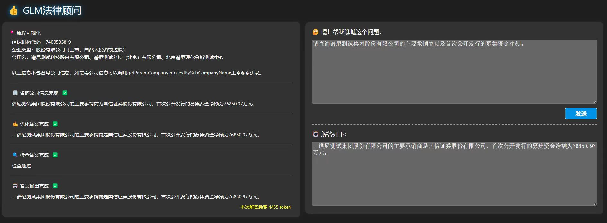

# GLM Law Solution A

# 方案介绍

本方案只在初赛A榜使用，后续时间不足未继续参赛。这是一个相对节省token的方案，目标是使用尽量少的token来相对可靠的完成问答任务。



# 方案思路

核心代码在 src/lib/question.ts、src/lib/api.ts、src/lib/llm.ts。

1. 输入问题后首先进行问题分类，将问题分为四类：
   - 公司信息
   - 历史案件
   - 法律条文
   - 日常聊天
2. 根据分类调用利用Function Call和Prompt工程调用相应函数进行预处理和API调用。
3. 出现调用API异常或者查询不到数据时，自动在迭代中修正。
3. 通过多次迭代直到题目所有信息收集完毕，由LLM完成最终回答。
4. 将回答进行格式化并检查是否已正确回答问题，否则重入迭代。

简单题目消耗一般在2k-5k token.
复杂题目消耗一般在8k-10k token.

## 快速开始

修改conifg.yml文件中的glm api key和天池team token。

需要先安装好node.js环境，可以在[Node.js官网](https://nodejs.org/en/download/prebuilt-installer)下载。

```shell
# 安装Yarn
npm install -g yarn --registry=https://registry.npmmirror.com
# 安装依赖
yarn install
# 启动
yarn start
```

## 访问WebUI

浏览器访问http://localhost:8656。