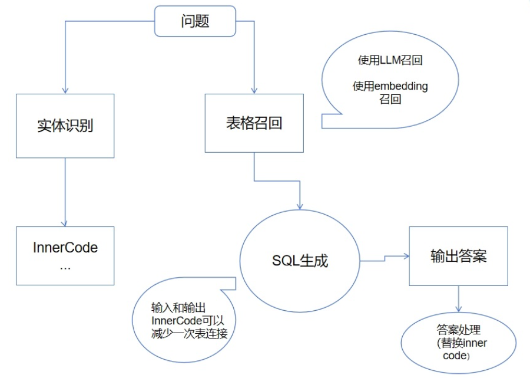

# 金融大模型挑战赛


# 赛制规则


# baseline解析




执行步骤

```python
for i in all_question:
    try:
        FantasticSql(i):
            # 将同一team中的三个连续问题拼接为一个str
        	# 实体识别
            info, tables = process_question(question_content)
            	process_question:
                    #调用大模型实现实体识别：基金公司、公司名称、代码
                    # 识别出实体之后进行查询语句找到相关信息
                recall_table():
                    # 进行表召回，传入所有表描述+连续问题->LLM推理出相关的表
                    # 召回的表获取数据字典中的表描述
                messages= 实体+召回表结构+连续问题 
                遍历team，根据messages逐个回答
                	尝试三次
                    	获取大模型回答answer
                        若answer中存在sql则调用接口执行sql获取查询结果
                        	将查询结果写入messages
                        若answer中不存在sql
	                        说明此时大模型根据查询结果回答了问题
                            保存回答写入文件
                            跳出循环
                        
    except Exception as e:  # 推荐使用Exception来捕获异常，更具体
   		traceback.print_exc()  # 打印异常信息
```


实体查询

```sql
SELECT InnerCode, CompanyCode, SecuCode, ChiName, ChiNameAbbr, EngName, EngNameAbbr, SecuAbbr, ChiSpelling
FROM ConstantDB.SecuMain
WHERE SecuCode = '600872'
     
```

查询结果

```json
[{'InnerCode': 2120, 'CompanyCode': 1805, 'SecuCode': '600872', 'ChiName': '中炬高新技术实业(集团)股份有限公司', 'ChiNameAbbr': '中炬高新', 'EngName': 'Jonjee Hi-Tech Industrial And Commercial Holding Co.,Ltd', 'EngNameAbbr': 'JONJEE', 'SecuAbbr': '中炬高新', 'ChiSpelling': 'ZJGX'}]
```


prompt拼接：实体+表结构+连续问题

```json
[{'role': 'system', 'content': '\n    任务：股票金融场景的sql编写问答，你将书写专业的金融行业SQL，确保理解用户的需求，纠正用户的输入错误，并确保SQL的正确性。\n    请仔细分析表结构后输出SQL.\n\n    用户会给你表格信息和问题，请你编写sql回答问题，\n    表格使用 DB.TABLE的形式，即 ```sql SELECT xxx from DB.TABLE```\n    数据库使用的是MySQL，\n    日期时间的查询方法为：\n    ```sql\n    DATE(STR_TO_DATE(TradingDay, \'%Y-%m-%d %H:%i:%s.%f\')) = \'2021-01-01\'\n    DATE(STR_TO_DATE(EndDate , \'%Y-%m-%d %H:%i:%s.%f\')) = \'2021-12-31\'\n    ```\n    所有查询请使用日，不要有时分秒。\n\n    你书写的sql在 ```sql ```内。\n\n    对于一些名称不确定的信息，如板块等，可以使用模糊查询，并且基于常识修正用户的输入。\n\n    用户的数据库描述为:\n    表格名称:AStockShareholderDB.LC_ShareTransfer\n描述:库名中文:上市公司股东与股本/公司治理\n库名英文:AStockShareholderDB\n表英文:LC_ShareTransfer\n表中文:股东股权变动\n表描述:1.收录公司股东股权转让、二级市场买卖、股权拍卖、大宗交易、股东重组等引起股东股权变动方面的明细资料，并包含与股权分置改革相关的股东增持、减持等信息。\n2.数据范围：1996-01-26至今\n3.信息来源：上交所和深交所大宗交易公开信息、临时公告等。\n\n字段描述:[\n {\n  "column_name": "ID",\n  "column_description": "ID"\n },\n {\n  "column_name": "CompanyCode",\n  "column_description": "公司代码",\n  "注释": "公司代码（CompanyCode）：与“证券主表（SecuMain）”中的“公司代码（CompanyCode）”关联，得到上市公司的交易代码、简称等。"\n },\n {\n  "column_name": "InfoPublDate",\n  "column_description": "信息发布日期"\n },\n {\n  "column_name": "InfoSource",\n  "column_description": "信息来源"\n },\n {\n  "column_name": "ContractSignDate",\n  "column_description": "股权转让协议签署日"\n },\n {\n  "column_name": "ApprovedDate",\n  "column_description": "转让批准日期"\n },\n {\n  "column_name": "TranDate",\n  "column_description": "股权正式变动日期/过户日期"\n },\n {\n  "column_name": "TransfererName",\n  "column_description": "股权出让方名称"\n },\n {\n  "column_name": "TansfererEcoNature",\n  "column_description": "股权出让方经济性质"\n },\n {\n  "column_name": "TranShareType",\n  "column_description": "出让股权性质",\n  "注释": "出让股权性质(TranShareType)与(CT_SystemConst)表中的DM字段关联，令LB = 1040，得到出让股权性质的具体描述：1-国家股，2-国有法人股，3-外资法人股，4-其他法人股，5-流通A股，6-B股，7-H股，8-转配股，9-专项资产管理计划转让，10-资产支持证券转让，11-中小企业私募债转让，12-中国存托凭证，13-可转换公司债券。"\n },\n {\n  "column_name": "SumBeforeTran",\n  "column_description": "出让前持股数量(股)"\n },\n {\n  "column_name": "PCTBeforeTran",\n  "column_description": "出让前持股比例"\n },\n {\n  "column_name": "SumAfterTran",\n  "column_description": "出让后持股数量(股)"\n },\n {\n  "column_name": "PCTAfterTran",\n  "column_description": "出让后持股比例"\n },\n {\n  "column_name": "ReceiverName",\n  "column_description": "接受股权质押方"\n },\n {\n  "column_name": "ReceiverEcoNature",\n  "column_description": "股权受让方经济性质"\n },\n {\n  "column_name": "SumAfterRece",\n  "column_description": "受让后持股数量(股)"\n },\n {\n  "column_name": "PCTAfterRece",\n  "column_description": "受让后持股比例"\n },\n {\n  "column_name": "TranMode",\n  "column_description": "股权转让方式",\n  "注释": "股权转让方式(TranMode)与(CT_SystemConst)表中的DM字段关联，令LB = 1202 AND DM NOT IN ( 8,51,55,57,98)，得到股权转让方式的具体描述：1-协议转让，2-国有股行政划转或变更，3-执行法院裁定，4-以资抵债，5-二级市场买卖，6-其他-股东重组，7-股东更名，9-其他-要约收购，10-以股抵债，11-大宗交易(席位)，12-大宗交易，13-其他-ETF换购，14-其他-行权买入，15-集中竞价，16-定向可转债转让，17-集合竞价，18-连续竞价，19-做市，20-询价转让，21-赠与，22-继承，24-间接方式转让，53-股改后间接股东增持，56-交易所集中交易，59-股权激励，70-国有股转持，71-老股转让，80-司法拍卖，99-其他。"\n },\n {\n  "column_name": "InvolvedSum",\n  "column_description": "涉及股数(股)"\n },\n {\n  "column_name": "PCTOfTansferer",\n  "column_description": "占出让方原持股数比例"\n },\n {\n  "column_name": "PCTOfTotalShares",\n  "column_description": "占总股本比例"\n },\n {\n  "column_name": "DealPrice",\n  "column_description": "交易价格(元/股)"\n },\n {\n  "column_name": "DealTurnover",\n  "column_description": "交易金额(元)"\n },\n {\n  "column_name": "ValidCondition",\n  "column_description": "生效条件"\n },\n {\n  "column_name": "TranStatement",\n  "column_description": "事项描述与进展说明"\n },\n {\n  "column_name": "IfSuspended",\n  "column_description": "是否终止实施",\n  "注释": "是否终止实施（IfSuspended），该字段固定以下常量：1-是；0-否"\n },\n {\n  "column_name": "SuspendedPublDate",\n  "column_description": "终止实施公告日期"\n },\n {\n  "column_name": "XGRQ",\n  "column_description": "修改日期"\n },\n {\n  "column_name": "JSID",\n  "column_description": "JSID"\n },\n {\n  "column_name": "SNBeforeTran",\n  "column_description": "出让前股东序号"\n },\n {\n  "column_name": "SNAfterTran",\n  "column_description": "出让后股东序号"\n },\n {\n  "column_name": "SNAfterRece",\n  "column_description": "受让后股东序号"\n },\n {\n  "column_name": "IfSPBlockTradeCode",\n  "column_description": "是否专场大宗交易代码",\n  "注释": "是否专场大宗交易代码（IfSPBLockTradeCode），该字段固定以下常量：1-是；0-否"\n },\n {\n  "column_name": "IfSPBlockTrade",\n  "column_description": "是否专场大宗交易"\n },\n {\n  "column_name": "InnerCode",\n  "column_description": "证券内部编码"\n },\n {\n  "column_name": "ResSumAfterTran",\n  "column_description": "其中:出让后有限售股数(股)"\n },\n {\n  "column_name": "NonResSumAfterTran",\n  "column_description": "其中:出让后无限售股数(股)"\n },\n {\n  "column_name": "ResSumAfterRece",\n  "column_description": "其中:受让后有限售股数(股)"\n },\n {\n  "column_name": "NonResSumAfterRece",\n  "column_description": "其中:受让后无限售股数(股)"\n },\n {\n  "column_name": "InitialInfoPublDate",\n  "column_description": "首次信息发布日期"\n },\n {\n  "column_name": "TransfererAttribute",\n  "column_description": "股权出让方所属性质"\n },\n {\n  "column_name": "TransfererCode",\n  "column_description": "股权出让方编码"\n },\n {\n  "column_name": "ReceiverAttribute",\n  "column_description": "股权受让方所属性质",\n  "注释": "股权受让方所属性质(ReceiverAttribute)与(CT_SystemConst)表中的DM字段关联，令LB = 1783 and DM in (1,2,3,99)，得到股权受让方所属性质的具体描述：1-自然人，2-企业，3-证券品种，99-其他。"\n },\n {\n  "column_name": "ReceiverCode",\n  "column_description": "股权受让方编码",\n  "注释": "当股权受让方所属性质(ReceiverAttribute)=2时，与“企业码表(EP_CompanyMain)”中的“企业编号(CompanyCode)”关联,得到事件主体企业的基本信息; 当股权受让方所属性质(ReceiverAttribute)=3时,与“证券码表总表(SecuMainAll)”中的“证券内部编码(InnerCode)”关联,得到事件主体证券品种的基本信息。"\n },\n {\n  "column_name": "InsertTime",\n  "column_description": "发布时间"\n },\n {\n  "column_name": "SumBeforeRece",\n  "column_description": "受让前持股数量(股)"\n },\n {\n  "column_name": "PCTBeforerRece",\n  "column_description": "受让前持股比例(%)"\n },\n {\n  "column_name": "TranStartDate",\n  "column_description": "股权变动起始日"\n },\n {\n  "column_name": "SerialNumber",\n  "column_description": "序号"\n }\n]\n表格名称:AStockShareholderDB.LC_ActualController\n描述:库名中文:上市公司股东与股本/公司治理\n库名英文:AStockShareholderDB\n表英文:LC_ActualController\n表中文:公司实际控制人\n表描述:1.收录根据上市公司在招投说明书、定期报告、及临时公告中披露的实际控制人结构图判断的上市公司实际控制人信息。_x000D_\n2.目前只处理实际控制人有变动的数据，下期和本期相比如无变化，则不做处理。\n3.数据范围：2004-12-31至今\n4.信息来源：招股说明书、上市公告书、定报、临时公告等。\n\n字段描述:[\n {\n  "column_name": "ID",\n  "column_description": "ID"\n },\n {\n  "column_name": "CompanyCode",\n  "column_description": "公司代码",\n  "注释": "公司代码（CompanyCode）：与“证券主表（SecuMain）”中的“公司代码（CompanyCode）”关联，得到上市公司的交易代码、简称等。"\n },\n {\n  "column_name": "InfoPublDate",\n  "column_description": "信息发布日期"\n },\n {\n  "column_name": "EndDate",\n  "column_description": "日期"\n },\n {\n  "column_name": "ControllerCode",\n  "column_description": "实际控制人代码",\n  "注释": "实际控制人代码（ControllerCode）：与“机构基本资料（LC_InstiArchive）”中的“企业编号（CompanyCode）”关联，得到实际控制人的名称，企业性质等信息。"\n },\n {\n  "column_name": "ControllerName",\n  "column_description": "实际控制人"\n },\n {\n  "column_name": "EconomicNature",\n  "column_description": "经济性质",\n  "注释": "实际控制人经济性质(EconomicNature)与(CT_SystemConst)表中的DM字段关联，令LB = 1581，得到实际控制人经济性质的具体描述：1-中央企业，2-地方国有企业，3-民营企业，4-集体企业，5-大学，6-外资，7-工会，99-其它。"\n },\n {\n  "column_name": "NationalityCode",\n  "column_description": "国籍代码",\n  "注释": "国籍代码（NationalityCode）：与“系统常量表”中的“代码（DM）”关联，令“LB=1023”，得到实际控制人的国籍编码。"\n },\n {\n  "column_name": "NationalityDesc",\n  "column_description": "国籍描述"\n },\n {\n  "column_name": "PermanentResidency",\n  "column_description": "永久境外居留权"\n },\n {\n  "column_name": "UpdateTime",\n  "column_description": "更新时间"\n },\n {\n  "column_name": "JSID",\n  "column_description": "JSID"\n },\n {\n  "column_name": "ControllerNature",\n  "column_description": "实际控制人所属性质",\n  "注释": "实际控制人所属性质(ControllerNature)与(CT_SystemConst)表中的DM字段关联，令LB = 1783，得到实际控制人所属性质的具体描述：1-自然人，2-企业，3-证券品种，99-其他。"\n }\n]\n表格名称:AStockBasicInfoDB.LC_StockArchives\n描述:库名中文:上市公司基本资料\n库名英文:AStockBasicInfoDB\n表英文:LC_StockArchives\n表中文:公司概况\n表描述:收录上市公司的基本情况，包括：联系方式、注册信息、中介机构、行业和产品、公司证券品种及背景资料等内容。\n\n字段描述:[\n {\n  "column_name": "ID",\n  "column_description": "ID"\n },\n {\n  "column_name": "CompanyCode",\n  "column_description": "公司代码",\n  "注释": "公司代码（CompanyCode）：与“证券主表（SecuMain）”中的“公司代码（CompanyCode）”关联，得到上市公司的交易代码、简称等。"\n },\n {\n  "column_name": "State",\n  "column_description": "国别",\n  "注释": "省份（State）：与“国家城市代码表（LC_AreaCode）”中的“地区内部编码（AreaInnerCode）”关联，得到省份具体信息。"\n },\n {\n  "column_name": "SecretaryBD",\n  "column_description": "董事会秘书"\n },\n {\n  "column_name": "SecuAffairsRepr",\n  "column_description": "证券/股证事务代表"\n },\n {\n  "column_name": "AuthReprSBD",\n  "column_description": "董秘授权代表"\n },\n {\n  "column_name": "ContactTel",\n  "column_description": "联系人电话"\n },\n {\n  "column_name": "ContactFax",\n  "column_description": "联系人传真"\n },\n {\n  "column_name": "ContactEmail",\n  "column_description": "联系人电子邮箱"\n },\n {\n  "column_name": "RegAddr",\n  "column_description": "公司注册地址"\n },\n {\n  "column_name": "RegZipCode",\n  "column_description": "公司注册地址邮编"\n },\n {\n  "column_name": "OfficeAddr",\n  "column_description": "公司办公地址"\n },\n {\n  "column_name": "OfficeZipCode",\n  "column_description": "公司办公地址邮编"\n },\n {\n  "column_name": "ContactAddr",\n  "column_description": "公司联系地址"\n },\n {\n  "column_name": "ConatactZipCode",\n  "column_description": "公司联系地址邮编"\n },\n {\n  "column_name": "Email",\n  "column_description": "邮箱"\n },\n {\n  "column_name": "Website",\n  "column_description": "公司网址"\n },\n {\n  "column_name": "DisclosureWebsites",\n  "column_description": "信息披露网址"\n },\n {\n  "column_name": "DisclosurePapers",\n  "column_description": "信息披露报纸"\n },\n {\n  "column_name": "EstablishmentDate",\n  "column_description": "公司成立日期"\n },\n {\n  "column_name": "IRegPlace",\n  "column_description": "首次注册登记地点"\n },\n {\n  "column_name": "LegalRepr",\n  "column_description": "法人代表"\n },\n {\n  "column_name": "GeneralManager",\n  "column_description": "总经理"\n },\n {\n  "column_name": "LegalConsultant",\n  "column_description": "法律顾问"\n },\n {\n  "column_name": "AccountingFirm",\n  "column_description": "会计师事务所"\n },\n {\n  "column_name": "InduCSRC",\n  "column_description": "公司所属证监会行业(聚源)",\n  "注释": "与(CT_IndustryType)表中的\\"行业内部编码(IndustryNum)\\"字段关联,当Standard=1时,LB=1；当Standard=22时,LB=22；当Standard=25时,LB=25；当Standard=26时,LB=26。"\n },\n {\n  "column_name": "BusinessMajor",\n  "column_description": "经营范围-主营"\n },\n {\n  "column_name": "BusinessMinor",\n  "column_description": "经营范围-兼营"\n },\n {\n  "column_name": "AShareAbbr",\n  "column_description": "A股证券简称"\n },\n {\n  "column_name": "AStockCode",\n  "column_description": "A股证券代码"\n },\n {\n  "column_name": "BShareAbbr",\n  "column_description": "B股证券简称"\n },\n {\n  "column_name": "BStockCode",\n  "column_description": "B股证券代码"\n },\n {\n  "column_name": "HShareAbbr",\n  "column_description": "H股证券简称"\n },\n {\n  "column_name": "HStockCode",\n  "column_description": "H股证券代码"\n },\n {\n  "column_name": "BriefIntroText",\n  "column_description": "公司简介"\n },\n {\n  "column_name": "XGRQ",\n  "column_description": "修改日期"\n },\n {\n  "column_name": "JSID",\n  "column_description": "JSID"\n },\n {\n  "column_name": "ChiName",\n  "column_description": "中文名称"\n },\n {\n  "column_name": "BusinessRegNumber",\n  "column_description": "企业法人营业执照注册号"\n },\n {\n  "column_name": "SecretaryBDTel",\n  "column_description": "董秘电话"\n },\n {\n  "column_name": "SecretaryBDFax",\n  "column_description": "董秘传真"\n },\n {\n  "column_name": "SecretaryBDEmail",\n  "column_description": "董秘电子邮件"\n },\n {\n  "column_name": "SecuAffairsReprTel",\n  "column_description": "证券事务代表电话"\n },\n {\n  "column_name": "SecuAffairsReprFax",\n  "column_description": "证券事务代表传真"\n },\n {\n  "column_name": "SecuAffairsReprEmail",\n  "column_description": "证券事务代表电子邮件"\n },\n {\n  "column_name": "CityCode",\n  "column_description": "地区代码",\n  "注释": "地区代码(CityCode)：与“国家城市代码表（LC_AreaCode）”中的“地区内部编码（AreaInnerCode）”关联，得到城市具体信息。"\n },\n {\n  "column_name": "CDRShareAbbr",\n  "column_description": "CDR证券简称"\n },\n {\n  "column_name": "CDRStockCode",\n  "column_description": "CDR证券代码"\n },\n {\n  "column_name": "ExtendedAbbr",\n  "column_description": "扩位简称"\n },\n {\n  "column_name": "SpecialVoteMark",\n  "column_description": "特殊表决权标识",\n  "注释": "特殊表决权标识（SpecialVoteMark）：在上市时发行人具有表决权差异安排的，其股票或存托凭证的特别标识为“W”；上市后不再具有表决权差异安排的，该特别标识取消，数据值为空。"\n },\n {\n  "column_name": "VIEMark",\n  "column_description": "协议控制架构标识",\n  "注释": "协议控制架构标识（VIEMark）：在上市时发行人具有协议控制架构或者类似特殊安排的，其股票或存托凭证的特别标识为“V”；上市后不再具有相关安排的，该特别标识取消，数据值为空。"\n },\n {\n  "column_name": "RedChipMark",\n  "column_description": "红筹企业标识",\n  "注释": "红筹企业标识（RedChipMark）：发行人属于红筹企业，则数据值=”是“；空值则指无此标识。"\n },\n {\n  "column_name": "RegArea",\n  "column_description": "所属区县",\n  "注释": "所属区县（RegArea）：与“国家城市代码表（LC_AreaCode）”中的“地区内部编码（AreaInnerCode）”关联，得到所属区县具体信息。\\n\\n\\n\\n\\n\\n"\n }\n]\n表格名称:ConstantDB.SecuMain\n描述:库名中文:常量库\n库名英文:ConstantDB\n表英文:SecuMain\n表中文:证券主表\n表描述:本表收录单个证券品种（股票、基金、债券）的代码、简称、上市交易所等基础信息。\n\n字段描述:[\n {\n  "column_name": "ID",\n  "column_description": "ID"\n },\n {\n  "column_name": "InnerCode",\n  "column_description": "证券内部编码"\n },\n {\n  "column_name": "CompanyCode",\n  "column_description": "公司代码",\n  "注释": "公司代码(CompanyCode)：当本表SecuCategory IN (8,13)即基金相关时，对应的基金管理人代码可通过本表InnerCode关联MF_FundArchives.InnerCode，取MF_FundArchives.InvestAdvisorCode"\n },\n {\n  "column_name": "SecuCode",\n  "column_description": "证券代码"\n },\n {\n  "column_name": "ChiName",\n  "column_description": "中文名称"\n },\n {\n  "column_name": "ChiNameAbbr",\n  "column_description": "中文名称缩写"\n },\n {\n  "column_name": "EngName",\n  "column_description": "英文名称"\n },\n {\n  "column_name": "EngNameAbbr",\n  "column_description": "英文名称缩写"\n },\n {\n  "column_name": "SecuAbbr",\n  "column_description": "证券简称"\n },\n {\n  "column_name": "ChiSpelling",\n  "column_description": "拼音证券简称"\n },\n {\n  "column_name": "ExtendedAbbr",\n  "column_description": "扩位简称"\n },\n {\n  "column_name": "ExtendedSpelling",\n  "column_description": "拼音扩位简称"\n },\n {\n  "column_name": "SecuMarket",\n  "column_description": "证券市场",\n  "注释": "证券市场(SecuMarket)与(CT_SystemConst)表中的DM字段关联，令LB = 201 AND DM IN (10,12,13,14,15,16,18,40,49,50,52,54,55,56,65,66,67,68,69,70,71,72,73,75,76,77,78,79,80,81,83,84,85,86,87,88,89,90,93,94,95,96,99,100,101,102,103,104,105,106,107,110,161,162,180,200,202,210,230,240,260,280,310,320,390,400,620,630,631,640,641,650,653,654,655,657,658,659,660,661,662,663,664,666,667,66302,66303,66305)，得到证券市场的具体描述：10-上海期货交易所，12-中国银行间外汇市场，13-大连商品交易所，14-上海黄金交易所，15-郑州商品交易所，16-上海票据交易所，18-北京证券交易所，40-芝加哥商业交易所，49-澳大利亚证券交易所，50-新西兰证券交易所，52-埃及开罗及亚历山大证券交易所，54-阿根廷布宜诺斯艾利斯证券交易所，55-巴西圣保罗证券交易所，56-墨西哥证券交易所，65-印度尼西亚证券交易所，66-泰国证券交易所，67-韩国首尔证券交易所，68-东京证券交易所，69-新加坡证券交易所，70-台湾证券交易所，71-柜台交易市场，72-香港联交所，73-一级市场，75-亚洲其他交易所，76-美国证券交易所，77-美国纳斯达克证券交易所，78-纽约证券交易所，79-美国其他交易市场，80-加拿大多伦多证券交易所，81-三板市场，83-上海证券交易所，84-其他市场，85-伦敦证券交易所，86-法国巴黎证券交易所，87-德国法兰克福证券交易所，88-欧洲其他交易所，89-银行间债券市场，90-深圳证券交易所，93-上海银行间同业拆借市场，94-瑞士证券交易所，95-荷兰阿姆斯特丹证券交易所，96-约翰内斯堡证券交易所，99-东京同业拆借市场，100-美国国债回购市场，101-伦敦银行同业拆借市场，102-香港银行同业拆借市场，103-新加坡银行同业拆借市场，104-中国银行同业拆借市场，105-欧元银行同业拆借市场，106-布鲁塞尔证券交易所，107-雅加达证券交易所，110-以色列特拉维夫证券交易所，161-意大利证券交易所，162-哥本哈根证券交易所，180-挪威奥斯陆证券交易所，200-斯德哥尔摩证券交易所，202-伊斯坦布尔证券交易所，210-印度国家证券交易所，230-奥地利维也纳证券交易所，240-西班牙马德里证券交易所，260-爱尔兰证券交易所，280-菲律宾证券交易所，310-机构间私募产品报价与服务系统，320-俄罗斯莫斯科证券交易所，390-里斯本证券交易所，400-芝加哥期权交易所，620-胡志明市证券交易所，630-沪市代理深市市场，631-沪市代理港交所市场，640-深市代理沪市市场，641-深市代理港交所市场，650-国际外汇市场(晨星)，653-上海环境能源交易所，654-北京绿色交易所，655-天津碳排放权交易中心，657-湖北碳排放权交易中心，658-重庆碳排放权交易中心，659-四川联合环境交易所，660-广州碳排放权交易所，661-海峡股权交易中心，662-深圳排放权交易所，663-欧洲能源交易所，664-全国碳排放权交易，666-布达佩斯证券交易所，667-全国温室气体自愿减排交易市场，66302-韩国ETS，66303-加拿大魁北克Cap-and-Trade(CaT)，66305-美国区域温室气体倡议（RGGI）。"\n },\n {\n  "column_name": "SecuCategory",\n  "column_description": "证券类别",\n  "注释": "证券类别(SecuCategory)与(CT_SystemConst)表中的DM字段关联，令LB = 1177 AND DM IN (1,2,4,5,6,7,8,9,10,11,12,13,14,15,16,17,18,19,20,21,23,26,27,28,29,30,31,32,33,35,36,37,38,39,40,41,42,43,44,45,46,47,55,79,80,211)，得到证券类别的具体描述：1-A股，2-B股，4-大盘，5-国债回购，6-国债现货，7-金融债券，8-开放式基金，9-可转换债券，10-其他，11-企业债券，12-企业债券回购，13-投资基金，14-央行票据，15-深市代理沪市股票，16-沪市代理深市股票，17-资产支持证券，18-资产证券化产品，19-买断式回购，20-衍生权证，21-股本权证，23-商业银行定期存款，26-收益增长线，27-新质押式回购，28-地方政府债，29-可交换公司债，30-拆借，31-信用风险缓释工具，32-浮息债计息基准利率，33-定期存款凭证，35-大额存款凭证，36-债券借贷，37-存款类机构质押式回购，38-存款类机构信用拆借，39-现货，40-货币对，41-中国存托凭证，42-协议回购，43-三方回购，44-利率互换品种，45-标准利率互换合约，46-报价回购，47-标准化票据，55-优先股，79-深市代理港交所股票，80-沪市代理港交所股票，211-自贸区债。"\n },\n {\n  "column_name": "ListedDate",\n  "column_description": "上市日期"\n },\n {\n  "column_name": "ListedSector",\n  "column_description": "上市板块",\n  "注释": "上市板块(ListedSector)与(CT_SystemConst)表中的DM字段关联，令LB = 207 AND DM IN (1,2,3,4,5,6,7,8)，得到上市板块的具体描述：1-主板，2-中小企业板，3-三板，4-其他，5-大宗交易系统，6-创业板，7-科创板，8-北交所股票。"\n },\n {\n  "column_name": "ListedState",\n  "column_description": "上市状态",\n  "注释": "上市状态(ListedState)与(CT_SystemConst)表中的DM字段关联，令LB = 1176 AND DM IN (1,3,5,9)，得到上市状态的具体描述：1-上市，3-暂停，5-终止，9-其他。"\n },\n {\n  "column_name": "ISIN",\n  "column_description": "ISIN代码"\n },\n {\n  "column_name": "XGRQ",\n  "column_description": "更新时间"\n },\n {\n  "column_name": "JSID",\n  "column_description": "JSID"\n }\n]\n    \n你本次需要回答的问题串为：\n600872的全称、A股简称、法人、法律顾问、会计师事务所及董秘是？\n该公司实控人是否发生改变？如果发生变化，什么时候变成了谁？是哪国人？是否有永久境外居留权？（回答时间用XXXX-XX-XX）\n在实控人发生变化的当年股权发生了几次转让？\n请在用户的引导下，一个一个完成问题，不要抢答\n    实体匹配数据表信息为：预处理程序通过表格：ConstantDB.SecuMain 查询到以下内容：\n [\n {\n  "InnerCode": 2120,\n  "CompanyCode": 1805,\n  "SecuCode": "600872",\n  "ChiName": "中炬高新技术实业(集团)股份有限公司",\n  "ChiNameAbbr": "中炬高新",\n  "EngName": "Jonjee Hi-Tech Industrial And Commercial Holding Co.,Ltd",\n  "EngNameAbbr": "JONJEE",\n  "SecuAbbr": "中炬高新",\n  "ChiSpelling": "ZJGX"\n }\n] \n,查询尽量使用InnerCode。\n    \n    用户提问中的公司名称，简称等问题，你可以直接回答 `InnerCode` 字段使用格式`InnerCode:xxx` (例如：用户问题A股最好的公司是？ 回答：`InnerCode:123`)\n    你书写的sql必须是一次可以执行完毕的，不要有注释，SQL一般不难，请不要过分复杂化，不要添加多余的过滤条件，\n    注意回答日期格式xxxx年xx月xx日，例如2020年01月01日 xxxx-xx-xx -> 2020-01-01 \n    '}, {'role': 'user', 'content': '\n    请编写sql解决问题：600872的全称、A股简称、法人、法律顾问、会计师事务所及董秘是？\n    '}]
```


# 优化想法


问题背景：当前baseline的表召回直接输入全部的表描述，过多的无关信息会产生干扰，因此考虑减少无关信息，精炼表描述从而提高表召回

解决方法：对表进一步划分，划分的前提是匹配范围对问题具有完备性，即划分的区间要能够满足问题的范围

如何确定每个问题涉及的表范围


库:表=1:n

表:字段=1:n

表:表=n:n


